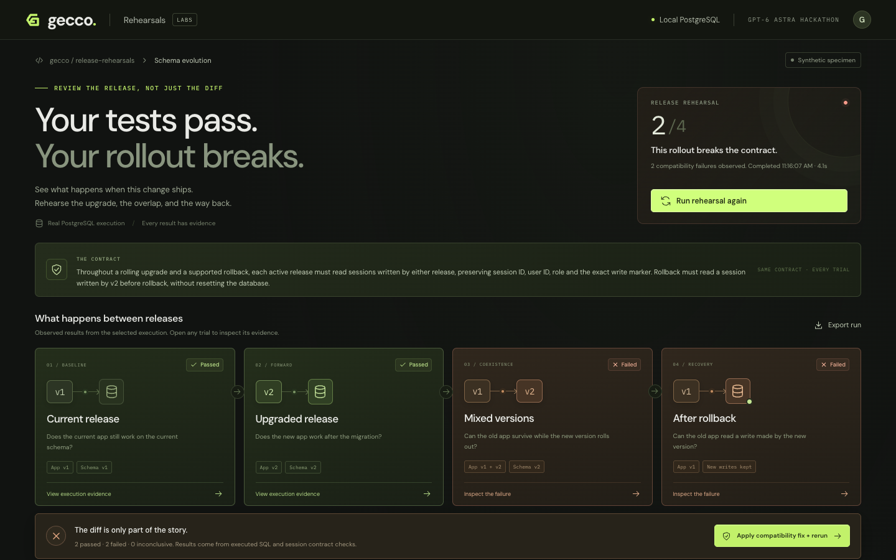

# Gecco Rehearsals

**See what happens when this change ships.**

A release can pass tests on the old code and the new code, then fail during rollout or rollback.
Gecco Rehearsals makes those transitions visible and executable.

Built as a public hackathon extension on September 10, 2026. This is a standalone vertical slice
of the Rehearsals concept, separate from the pre-existing private Gecco code-review application.
The code in this repository is new hackathon work.



## The demo

A session-storage migration changes a column and the JSON payload it stores. Rehearsals runs
four trials against disposable PostgreSQL databases:

| Trial | Question |
| --- | --- |
| Current release | Does the existing version work with the historical fixture? |
| Upgrade | Does the new version work after migration? |
| Mixed versions | Can an old instance still serve requests during rollout? |
| Rollback after writes | Can the old version read a record the new version created? |

The breaking migration passes the first two and exposes failures in the last two. A bundled
compatibility fix reruns the same contract. Both variants are inspectable source files; the
fix button selects that prepared variant rather than applying model-generated code. Each result
retains the actual SQL, observations and state lineage. AI analysis explains risks in the change;
database execution independently establishes outcomes.

## Run locally

Requires Node.js 22.12+ and pnpm 10.

```sh
pnpm install --frozen-lockfile
pnpm dev
```

Open [the local console](http://127.0.0.1:5180). The API runs on port 5181.

```sh
pnpm test
pnpm build
pnpm rehearse
```

The default CLI intentionally exits with code 1 when it observes the breaking specimen's failures.
Run the compatible variant and export either result:

```sh
pnpm rehearse breaking --output artifacts/breaking.json
pnpm rehearse compatible --output artifacts/compatible.json
```

For a stable local production build, run `pnpm build` then `pnpm start` and open
[the built console](http://127.0.0.1:5181). The API and built frontend share one loopback port.
`GECCO_PORT` can change that port.

## Live AI analysis

Install the [Codex CLI](https://developers.openai.com/codex/cli/) and run `codex login` if you
want live analysis. The server uses your existing CLI authentication; credentials are not
copied into this repository. `GECCO_AI_MODEL` overrides the model, otherwise the configured
Codex model is used. This hackathon instance is configured for `gpt-6-astra`.
On macOS, the adapter prefers the runtime bundled in the installed Codex app, because older
global CLIs may not support the configured model. `GECCO_CODEX_BIN` selects an explicit binary.

Only the fixed public specimen and contract enter the model prompt. Analysis uses noninteractive
Codex with a read-only sandbox, structured output and a bounded lifetime. AI requests may consume
your provider usage. The database demo works without an AI account or network connection.

Successful analyses are cached in this browser against the exact specimen inputs. Restored
responses are labeled **Recorded analysis** with the original timestamp. A fresh request always
calls the configured model. The fix button selects the supplied compatible code; AI text is
never executed.

## Verified demo

- 16 engine/API regression tests pass, including real PostgreSQL trials, retained writes,
  setup failure, independent fixtures, cancellation and persisted evidence.
- Production build and public Linux CI pass.
- Actual `gpt-6-astra` inference has been exercised on both source variants.
- Browser acceptance covers breaking run, SQL evidence, compatibility rerun, live analysis and
  recorded-analysis restoration after reload.

See the [validation record](docs/VALIDATION.md) for scope and provenance.

## Scope

The specimen runs actual PostgreSQL through PGlite (PostgreSQL compiled to WebAssembly).
The runner executes only the trusted bundled specimen. It is not an arbitrary-repository sandbox,
and it does not connect to a production database. Source and fixture digests identify the inputs;
trial databases reset between trials while state persists through each trial's transitions.

The defects are deliberately constructed to demonstrate release compatibility failures. They are
not a benchmark of AI detection accuracy. A passing rehearsal is evidence about its declared
contract and fixture, not a guarantee that a release is safe.

## Project

- [Hackathon plan](docs/HACKATHON-PLAN.md)
- [Demo script](docs/DEMO.md)
- [Architecture](docs/ARCHITECTURE.md)
- [MIT license](LICENSE)

No private Gecco repository, account, operational archive or database is needed for execution.
Live AI analysis is optional and reports unavailability explicitly when no provider is configured.
