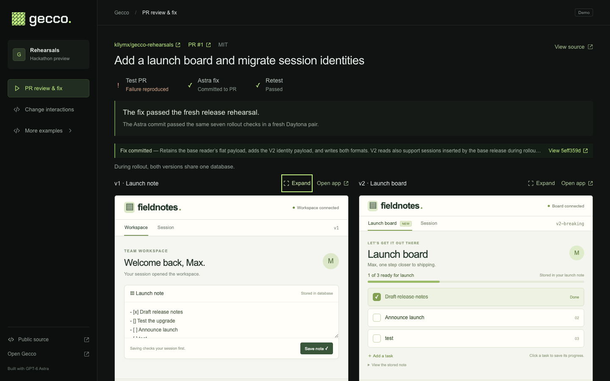
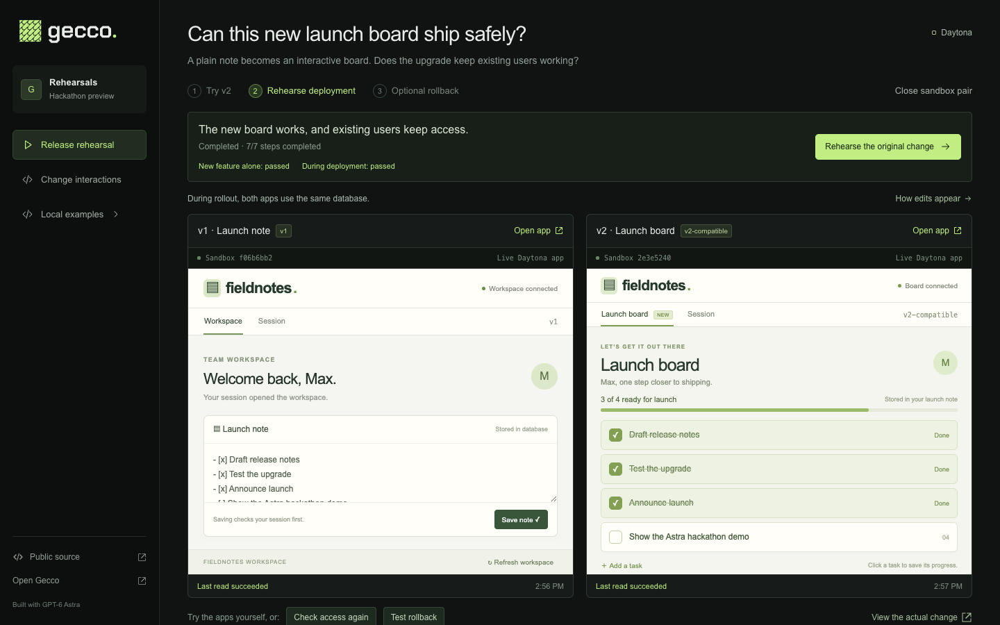
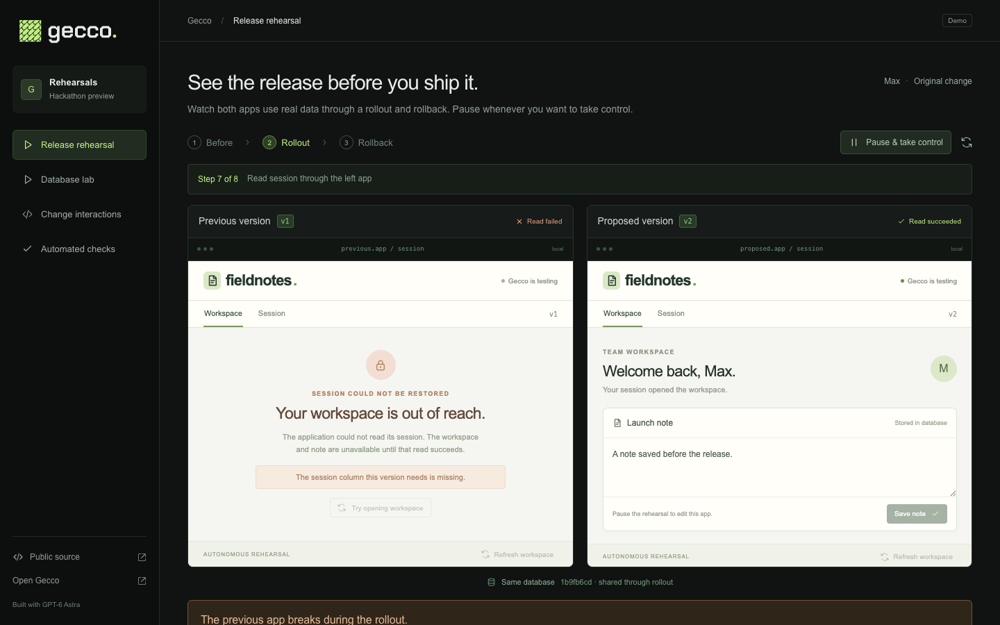
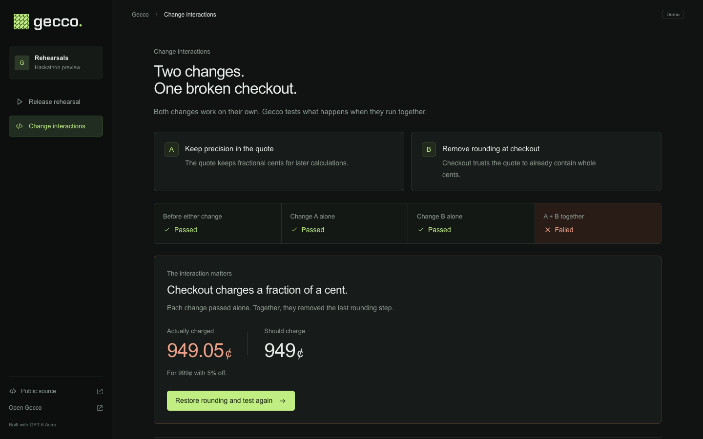

# Gecco Rehearsals

**See what happens when this change ships.**

A release can pass tests on the old code and the new code, then fail during rollout or rollback.
Gecco Rehearsals makes those transitions visible and executable.

Built as a public hackathon extension on September 10, 2026. This is a standalone vertical slice
of the Rehearsals concept, separate from the pre-existing private Gecco code-review application.
The code in this repository is new hackathon work.

## Public PR review and repair

Start with [public PR #1](https://github.com/kllymx/gecco-rehearsals/pull/1). Gecco runs its exact
base and proposed commits in Daytona. After a reproduced failure, **Ask Astra to fix & rerun**
asks live GPT-6 Astra for a patch, validates it, appends a commit to the same PR, and reruns that
commit in fresh sandboxes. The PR, original failure, generated commit and retest stay inspectable.

The source is MIT licensed. GitHub, Daytona and the Astra model service require your own access.
The workflow currently supports this repository's fixed sample PR recipe. See the
[setup, repair boundaries and current acceptance record](docs/PR-REPAIR.md).



*Verified September 10: the original PR failed during rollout. Live GPT-6 Astra generated
[repair commit `5eff359`](https://github.com/kllymx/gecco-rehearsals/commit/5eff359d6f0a5fac3d1d814d286539ffb29a1bb8),
which passed 15 native PostgreSQL checks before publication and all seven rollout checks in fresh
Daytona sandboxes afterward. The PR remains open. [Complete execution evidence](docs/evidence/pr-1-astra-repair-proof.json).*

A checkbox saved in the repaired board also appeared in the old app through normal polling,
without a manual refresh. [Recorded interaction and restoration](docs/evidence/pr-1-repaired-interaction-proof.json).
The same repair also passed [independent exact-commit validation on GitHub](https://github.com/kllymx/gecco-rehearsals/actions/runs/34529977675).

## The executable sample

**More examples → Daytona fixtures** provisions two full, private **Daytona sandboxes** running
Fieldnotes, the sample workspace app in this public repository. Each sandbox gets a real source
checkout, installed dependencies, a Node HTTP server, its own filesystem and native PostgreSQL.
The embedded previews load the applications directly from separate Daytona origins.

The change turns a plain launch note into an interactive launch board. Gecco first tests the old
and proposed versions with independent databases, then uses the proposed app to check **Test the
upgrade** and save it. The feature works on its own; the previous app's separate note is unchanged.

Next, Gecco migrates the old app's database and connects the proposed app through an authenticated
gateway for the sample's fixed SQL statements. Both versions now operate on the same data during
rollout. The new app writes a session and saves a checked launch item against that shared data.
Gecco checks whether the old app can still open the workspace. The main journey finishes with
**v1 and v2 still running side by side**, so the working new feature and its compatibility effects
remain visible.

**Test rollback** is a separate action. It checks out the original source, restarts the proposed
app and reads the retained data through both old versions. The console shows what the running
applications actually read or fail to read.

Pause to open either workspace and edit a note, then resume the server's autonomous journey.
Reloading the console does not cancel accepted work. Inspect the source commits, sandbox and
process identities, database identities, and SQL observations behind each result.

The original change passes when each version is tested independently. During rollout, the old
version loses its session column. After rollback, the column is restored but contains data its
old decoder cannot read. A fresh rehearsal with the supplied compatibility fix preserves both
representations. This fixture option selects inspectable supplied source. The separate
**PR review & fix** flow requests a live generated patch instead.
See [Daytona setup, limits and current validation](docs/DAYTONA.md). Cloud execution requires a
Daytona account and network access; missing configuration is shown explicitly.



*Live acceptance, September 10: a checkbox and a new task saved in v2 were read back by v1
from the shared native PostgreSQL database. [Original failure evidence](docs/evidence/launch-board-breaking-proof.json)
and [compatible interaction evidence](docs/evidence/launch-board-shared-proof.json) are recorded results;
signed preview links and credentials are omitted.*

## Local examples

The **More examples** menu preserves the earlier local demonstrations, which need no cloud account.
**Local sample** runs independent local Node processes with PGlite databases. **Database lab**
lets you step through actual rows and schema manually in PGlite, PostgreSQL compiled to WebAssembly.
These are separate execution modes from the native PostgreSQL processes in Daytona.

For a complete execution in one action, **Automated checks** runs four independent trials:

| Trial | Question |
| --- | --- |
| Current release | Does the existing version work with the historical fixture? |
| Upgrade | Does the new version work after migration? |
| Mixed versions | Can an old instance still serve requests during rollout? |
| Rollback after writes | Can the old version read a record the new version created? |

The original passes the first two and exposes failures in the last two. Source, SQL,
optional Astra analysis and previous completed runs are available on demand. AI analysis
explains risks in the change; database execution independently establishes outcomes.



*This screenshot shows the local PGlite sample, not a Daytona execution.*

The second demonstration asks what happens when two changes land together. Two bundled synthetic
PRs each pass the same payment contract independently, while their combined behavior charges
fractional cents. Four configurations execute six shared inputs; restoring rounding at the payment
boundary makes all 24 observations pass. This panel runs local TypeScript functions with an
independent integer-arithmetic oracle.



## Run locally

Requires Node.js 22.12+ and pnpm 10.

```sh
pnpm install --frozen-lockfile
pnpm dev
```

Open [the local console](http://127.0.0.1:5180). The API runs on port 5181.
Choose a local mode under **More examples** to explore without Daytona, or configure the cloud rehearsal below.

```sh
pnpm test
pnpm build
pnpm rehearse
```

The default CLI intentionally exits with code 1 when it observes the breaking specimen's failures.
Run the compatible variant and export either result:

```sh
pnpm rehearse breaking --output artifacts/breaking.json
pnpm rehearse compatible --output artifacts/compatible.json
```

For a stable local production build, run `pnpm build` then `pnpm start` and open
[the built console](http://127.0.0.1:5181). The API and built frontend share one loopback port.
`GECCO_PORT` can change that port.

## Run the Daytona rehearsal

Follow the [Daytona guide](docs/DAYTONA.md) to obtain an API key. The example configuration pins
the three published sample commits. Keep these settings in the gitignored `.env.daytona` file:

```sh
cp .env.example .env.daytona
chmod 600 .env.daytona
# Fill in DAYTONA_API_KEY; retain the pinned sample refs for this demo.
pnpm build
node --env-file=.env.daytona --import tsx server/index.ts
```

Open [the built console](http://127.0.0.1:5181) and choose **Run PR rehearsal**, or use
**More examples → Daytona fixtures** for the supplied candidates. A request starts
provisioning and returns immediately; progress continues on the server. Initial image preparation,
package installation and source checkout take time. **Close sandboxes** stops and deletes both
instances, then verifies cleanup. The provider permits one active pair at a time.

To access the demo from another device on your Tailscale network, configure an explicit
HTTPS origin when starting the server, then proxy the loopback port with Tailscale Serve:

```sh
GECCO_PUBLIC_ORIGIN=https://your-device.your-tailnet.ts.net:10000 node --env-file=.env.daytona --import tsx server/index.ts
tailscale serve --bg --https=10000 http://127.0.0.1:5181
```

Use your device's actual Tailscale DNS name. The server still listens only on loopback;
the configured HTTPS host and origin are accepted through the local proxy. Tailscale Serve
is accessible within your tailnet. Disable this route with `tailscale serve --https=10000 off`.

## Live AI analysis in the local examples

Install the [Codex CLI](https://developers.openai.com/codex/cli/) and run `codex login` if you
want live analysis. The server uses your existing CLI authentication; credentials are not
copied into this repository. `GECCO_AI_MODEL` overrides the model, otherwise the configured
Codex model is used. This hackathon instance is configured for `gpt-6-astra`.
On macOS, the adapter prefers the runtime bundled in the installed Codex app, because older
global CLIs may not support the configured model. `GECCO_CODEX_BIN` selects an explicit binary.

For a compatible Responses proxy, set both `OPENAI_BASE_URL` and `OPENAI_API_KEY`, or point
`GECCO_AI_ENV_FILE` at a private env file containing them. This explicitly selects that endpoint
for analysis and PR repairs. See [proxy setup](docs/PR-REPAIR.md#use-an-openai-compatible-proxy).

Only the fixed public specimen and contract enter the model prompt. Analysis uses noninteractive
Codex with a read-only sandbox, structured output and a bounded lifetime. AI requests may consume
your provider usage. The local database examples work without an AI account or network connection.
Daytona cloud execution does not require AI analysis.

Successful analyses are cached in this browser against the exact specimen inputs. Restored
responses are labeled **Recorded analysis** with the original timestamp. A fresh request always
calls the configured model. In these local examples, the fix button selects supplied compatible
code. The separate PR repair pipeline validates and executes generated code as described above.

## Validation

- Engine/API regression tests cover real PostgreSQL trials, retained writes,
  setup failure, independent fixtures, cancellation, persisted evidence and change interactions.
- Local paired app tests verify live process independence, database routing, note writes, process replacement,
  retained data, autonomous execution, pause/resume, revision checks and cleanup.
- Actual `gpt-6-astra` inference has been exercised on both source variants.
- Browser acceptance covers breaking run, SQL evidence, compatibility rerun, live analysis and
  recorded-analysis restoration after reload, plus both interaction variants and JSON export.
- The interactive lab has been exercised through the original and compatible transitions,
  including personalized records, stale reads, reload restoration and matching JSON exports.
- Local paired browser acceptance covers both variants, pause and edit, shared-note reads, resume after
  reload, and exported proof that the custom note remains through a failing rollback.
- Daytona provider and cloud API tests cover durable create intent, uncertain outcomes, bounded
  execution, private previews, cleanup, coordinator restart and autonomous control using mocks.
- A live Daytona smoke run used Node.js 22 and native PostgreSQL 15.19. The breaking sample
  passed independently, failed in the old app during rollout, and failed in both apps after rollback.
- The earlier compatible Daytona journey completed all seven actions with passing reads, an actual Git
  checkout to the base source, a new app instance, and retained shared data. Manual browser testing
  confirmed a note saved in one sandbox appeared in the other app. See the
  [cloud validation scope](docs/DAYTONA.md#validation-scope).

See the [validation record](docs/VALIDATION.md) for scope and provenance.

## Scope

Cloud execution runs the fixed public Fieldnotes sample at configured, published commits in
Daytona, with native PostgreSQL inside each sandbox. It currently has no arbitrary-repository
or arbitrary-command input. Local examples execute the trusted bundled specimen through PGlite.
Neither mode connects to a production database. Source and fixture identities identify inputs;
fresh rehearsals start with fresh databases while each rehearsal retains data through transitions.

The defects are deliberately constructed to demonstrate release compatibility failures. They are
not a benchmark of AI detection accuracy. A passing rehearsal is evidence about its declared
contract and fixture, not a guarantee that a release is safe.

## Project

- [Hackathon plan](docs/HACKATHON-PLAN.md)
- [Daytona cloud rehearsal](docs/DAYTONA.md)
- [Demo script](docs/DEMO.md)
- [Interactive lab behavior](docs/INTERACTIVE-LAB.md)
- [Paired applications and autonomous journey](docs/PAIRED-APPS.md)
- [Architecture](docs/ARCHITECTURE.md)
- [MIT license](LICENSE)

No private Gecco repository, account, operational archive or database is needed for execution.
Live AI analysis is optional and reports unavailability explicitly when no provider is configured.
